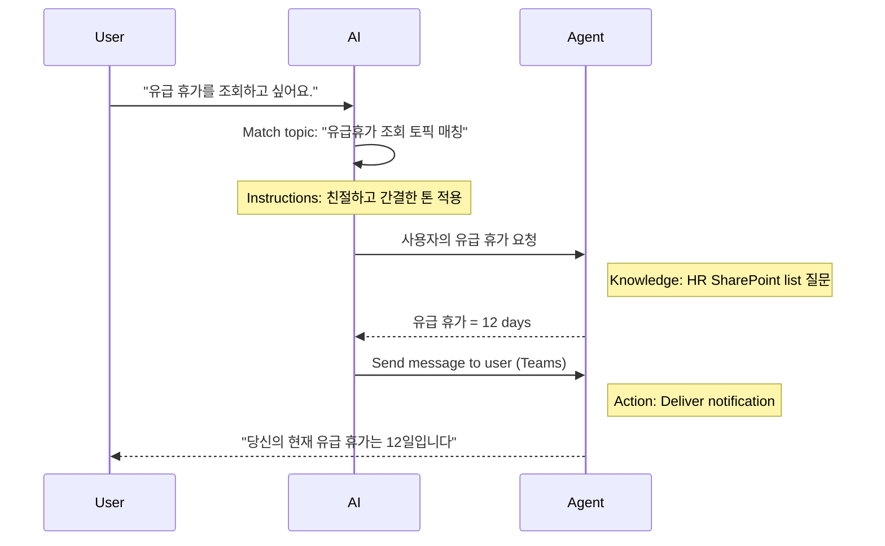

# 🚨 Mission 02: Copilot Studio 기초

## 🕵️‍♂️ CODENAME: `OPERATION CORE PROTOCOL`

> **⏱️ Operation Time Window:** `~30분 – 정보 학습 중심, 실습 없음`  

## 🎯 Mission Brief

환영합니다, 리크루트. 이번 미션에서는 Copilot Studio가 어떻게 동작하는지, 그리고 실제 비즈니스 가치를 제공하는 지능형 에이전트를 어떻게 구축하는지 이해하기 위한 기본 정보를 제공합니다.

첫 번째 에이전트를 만들기 전에, 모든 커스텀 AI 에이전트를 구성하는 네 가지 핵심 요소인 Knowledge, Tools, Topics, Instructions를 이해해야 합니다. 또한 이러한 요소들이 Copilot Studio 오케스트레이터에서 어떻게 함께 동작하는지도 배우게 됩니다.

## 🔎 Objectives

이 미션에서 여러분은 다음을 배우게 됩니다:

- **Copilot Studio가 무엇인지 이해하기**
- **언제 그리고 왜 에이전트를 사용하는지 학습하기**
- **에이전트의 네 가지 핵심 구성 요소 탐색하기**
      - **Knowledge**
      - **Tools**
      - **Topics**
      - **Instructions**
- **이 요소들이 어떻게 함께 동작하여** 지능형 자동화 에이전트를 만드는지 이해하기

## What Are Agents in Copilot Studio?

**에이전트(agent)** 는 특정 작업을 처리하도록 설계된 특화된 AI 어시스턴트입니다. 일반적인 챗봇과 달리, 여러분의 에이전트는 다음과 같은 특징을 가집니다:

- **회사 고유의 데이터**(정책, 문서, 데이터베이스 등)를 이해합니다  
- **실제 업무 작업 수행**(메시지 전송, 일정 생성, 기록 업데이트 등)이 가능합니다  
- **대화 맥락을 유지**하여 이전 질문을 기반으로 후속 응답을 할 수 있습니다  

Copilot Studio는 로우코드 기반이므로 사전 제작된 컴포넌트를 드래그 앤 드롭하여 코딩 없이도 에이전트를 만들 수 있습니다. 에이전트를 완성하면 Teams, Slack 또는 커스텀 웹페이지에서도 사용하여 자동으로 답변을 받거나 워크플로우를 실행할 수 있습니다.

## When and Why to Use Copilot Studio

Microsoft 365 Copilot은 Office 앱 전반에서 일반적인 AI 지원을 제공하지만, 다음과 같은 경우에는 커스텀 에이전트가 필요합니다:

### 여러 데이터 소스의 지식을 조합해야 할 때

- M365 Copilot은 M365(SharePoint, Outlook 등)의 정보를 가져오는 데 강점이 있지만, 더 다양한 지식 소스를 검색해야 하는 상황에서는 에이전트가 적합합니다.

### 여러 단계의 워크플로우를 자동화하고 싶을 때

- 예시: "누군가 비용을 제출하면 승인 요청을 보내고, 재무 트래커를 업데이트하고, 매니저에게 알림 보내기."  
  커스텀 에이전트는 하나의 명령이나 이벤트로 전체 단계를 처리할 수 있습니다.  

### 컨텍스트 기반의 인-툴 경험이 필요할 때

- 예를 들어 Teams 안에서 동작하는 신규 입사자 온보딩 에이전트가 HR 정책을 안내하고, 필요한 양식을 전송하며, 오리엔테이션 미팅을 예약할 수 있습니다.

## Four Building Blocks of an Agent

모든 Copilot Studio 에이전트는 다음 네 가지 핵심 구성 요소로 이루어집니다:

1. **Knowledge**  
1. **Tools (Actions)**  
1. **Topics**  
1. **Instructions**

아래에서는 각 구성 요소를 정의하고, 이들이 어떻게 함께 동작하여 효과적인 에이전트를 만드는지 설명합니다.

### 1. Knowledge

**Knowledge** 는 에이전트가 정확한 답변을 제공하기 위해 사용하는 데이터와 컨텍스트입니다. 두 가지 요소로 구성됩니다:

#### Custom Instructions & Context

- 에이전트의 목적과 톤을 간단히 설명합니다. 예시:

    ```text
    당신은 IT 지원 에이전트입니다. 직원들이 일반적인 소프트웨어 문제를 해결하도록 돕고, 문제 해결 단계를 제공하며, 긴급 티켓을 에스컬레이션합니다.
    ```

- 대화 중 에이전트는 이전 대화를 기억하여 이미 논의된 내용을 참조할 수 있습니다.

#### Knowledge Sources (Grounding Data)

- SharePoint 라이브러리, 문서 사이트, 위키 또는 기타 데이터베이스 등 여러 데이터 소스를 연결할 수 있습니다.  
- 사용자가 질문하면 에이전트는 관련 정보를 가져와 실제 조직의 정책이나 매뉴얼에 기반한 **grounded** 답변을 제공합니다.  
- 특정 데이터 소스의 정보만 사용하도록 제한하여 추측성 답변을 방지할 수도 있습니다.

> [!NOTE]   
> Example: "Policy Assistant" 에이전트가 HR SharePoint에 연결되어 있다면, "우리 PTO 적립률이 어떻게 되나요?"라는 질문에 HR 정책 문서의 정확한 내용을 가져옵니다.

### 2. Tools (Actions)

**Tools (Actions)** 는 에이전트가 단순 대화를 넘어 실제 작업을 수행할 수 있게 합니다.

- 이메일 또는 Teams 메시지 전송  
- 일정 생성 또는 수정  
- 데이터베이스 기록 추가/수정  
- Power Automate 플로우 또는 REST API 호출  

#### How Actions Work

- **입력과 출력 정의**  
      - 예: Send Email 액션  
        - `RecipientEmailAddress`  
        - `SubjectLine`  
        - `EmailBody`  

- **여러 액션을 워크플로우로 결합**  
      - 예시 흐름:  
             1. SharePoint 리스트에서 데이터 조회  
             2. LLM으로 요약 생성  
             3. Teams 메시지 전송  

- **외부 시스템 연결**  
      - CRM 업데이트나 내부 API 호출을 위한 커스텀 액션 생성 가능  
      - Copilot Studio는 Power Platform 또는 HTTP 엔드포인트와 통합 가능

> [!NOTE]   
> "Expense Helper" 에이전트 예시:
> 1. "Submit Expense" 요청 감지  
> 1. 폼에서 비용 정보 수집  
> 1. SharePoint 리스트에 저장  
> 1. 승인자에게 이메일 전송  

### 3. Topics

**Topics** 는 에이전트의 대화 트리거나 진입 지점을 정의합니다.

#### Conversational Triggers  

- 예: "Submit IT Ticket", "Check Vacation Balance", "Create Sales Report"  
- Copilot Studio는 생성형 오케스트레이션을 사용하여 정확한 키워드가 아니라 의도를 기반으로 Topic을 선택합니다.

#### Topic Descriptions  

- 각 Topic에 해당 기능을 설명하는 간단한 설명을 작성합니다.

> [!NOTE]   
> Topic 설명 예시: 이 Topic은 사용자로부터 문제 상세, 우선순위, 연락처 정보를 수집하여 IT 지원 티켓을 제출하도록 돕습니다.

#### Mapping Topics to Actions  

- Topic은 하나 이상의 액션이나 데이터 조회와 연결됩니다.  
- AI가 Topic을 선택하면 정의된 흐름에 따라 대화를 진행합니다.

> [!NOTE]   
> Example: "새 노트북 설정 도움이 필요해요"라는 요청 → "Submit IT Ticket" Topic 매칭 → 정보 수집 후 헬프데스크 티켓 생성

### 4. Instructions

**Instructions** 는 LLM의 톤, 스타일, 응답 규칙을 정의합니다.

#### Role & Persona  

- 예: "당신은 Contoso Retail의 고객 서비스 에이전트입니다."  
- 이를 통해 응답 톤을 설정합니다.

#### Response Guidelines  

- 예시 규칙:
      - "항상 정책 정보를 bullet point로 요약한다."  
      - "모르면 ‘해당 정보를 가지고 있지 않습니다.’라고 답한다."  
      - "기밀 데이터는 포함하지 않는다."

#### Memory & Context Rules

- 몇 턴의 대화를 기억할지 정의할 수 있습니다.

> [!NOTE]   
> "Benefits Advisor" 에이전트 예시: "항상 최신 HR 핸드북을 기준으로 답변하세요. 등록 마감일은 정책의 실제 날짜를 제공하고, 답변은 150단어 이내로 유지하세요."

## How the Four Building Blocks Work Together

**Knowledge**, **Tools**, **Topics**, **Instructions**를 조합하면 Copilot Studio 오케스트레이터는 다음과 같이 동작합니다:

1. **적절한 Topic 감지**  
1. **Instructions 적용**  
1. **Knowledge 활용하여 grounded 응답 생성**  
1. **Tools 호출로 실제 작업 수행**  

오케스트레이터는 생성형 플래닝 방식을 사용하여 어떤 순서로 작업을 수행할지 결정합니다. 액션 실패 시에는 예외 처리 규칙을 따릅니다. LLM은 대화 맥락을 유지하며 새로운 정보를 반영합니다.

**Visual Flow Example:**  
<!--
1. **User:** "유급 휴가를 조회하고 싶어요"
1. **AI (Topics):** "유급휴가 조회 토픽 매칭"
1. **AI (Instructions):** "친절하고 간결한 톤을 사용하세요"
1. **Agent (Knowledge):** "사용자의 휴가 조회를 위해 HR 쉐어포인트에 질문."
1. **Agent (Actions):** "값을 조회하여 찾아오고, 팀즈 메시지 보내기"
   > "당신의 현재 유급 휴가는 12일입니다."  
-->



---

## 🎉 Mission Complete

기초 브리핑을 성공적으로 완료했습니다. 이제 Copilot Studio 에이전트를 구성하는 네 가지 핵심 요소를 이해했습니다:

1. **Knowledge** – 사실 기반 정보 조회와 대화 메모리 유지  
1. **Tools** – 자동 작업 수행  
1. **Topics** – 사용자 의도 인식과 워크플로우 선택  
1. **Instructions** – 응답 규칙과 톤 정의

이제 기본적인 질문 응답과 간단한 워크플로우를 수행하는 에이전트를 만들 수 있습니다. 다음 단계에서는 "Service Desk" 에이전트를 직접 만들어 보게 됩니다.

Up next: You'll build your [first declarative agent for M365 Copilot](../03-create-a-declarative-agent-for-M365Copilot/index-kr.md).

<!-- markdownlint-disable-next-line MD033 -->

